<style type="text/css">

body{ /* Normal  */
      font-size: 22px;
  }
  
p.caption {
  font-size: 0.9em;
}
</style>

<div class="figure">
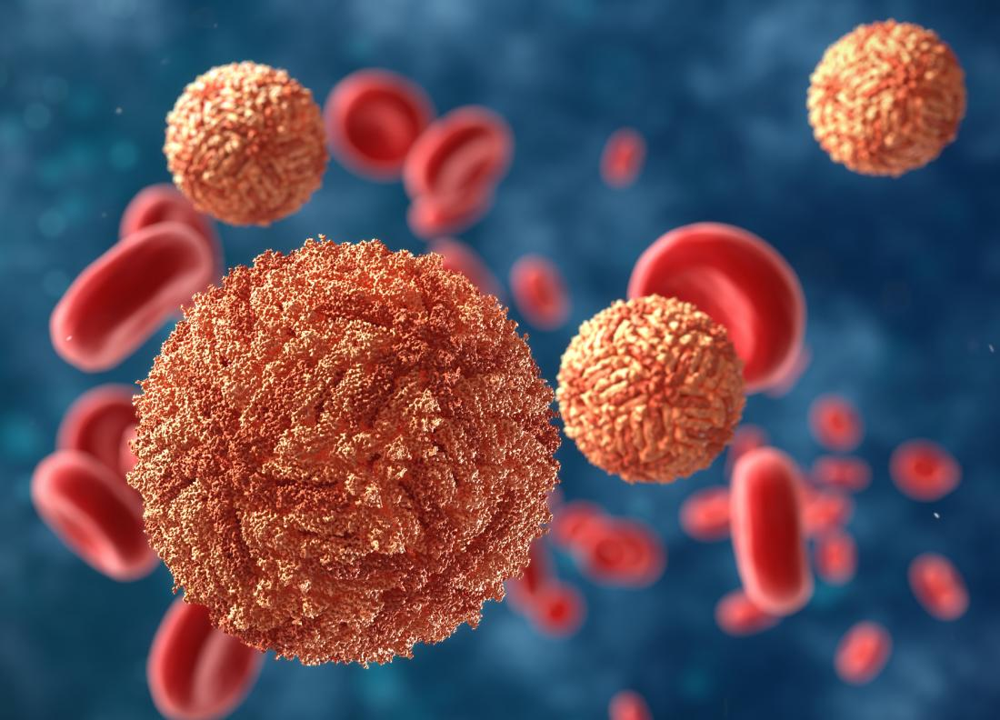
<p class="caption">Zika Virus in the Blood Steam</p>
</div>

******
# Purpose of the Project
******

This is a validation of a custom RNA-seq pipeline. For this project, I downloaded RNA-seq read data from a [2016 publication](https://www.ncbi.nlm.nih.gov/pmc/articles/PMC5299540/) (Figure 1) via NCBI and then re-analyzed the data to see if I could obtain similar results.

Here I present a reproducible open source RNA-seq pipeline delivered as an R notebook. The pipeline uses state-of-the-art tools from Bioconductor, and generates publication-ready figures important to every RNA-seq analysis:

- MA Plot
- Volcano Plot
- Dendogram Heatmap Plot
- Principal Component Analysis Plot

Finally, the pipeline outputs a list of differentially expressed genes that can be analyzed for gene ontology enrichment and KEGG pathway analysis.

<div class="figure">

<p class="caption">Figure 1. The manuscript of the original publication</p>
</div>

The figure above is a manuscript of the original publication. The research group is interested in what biological pathways are associated with the Zika virus and microcephaly. 

Before we delve deeper into the experimental design of the study and the validation of the RNA-seq pipeline, let's provide some background on the Zika Virus.

******
# Introduction to the Zika Virus 
******

Recall in 2015, there were reports of the first re-occurrence of the Zika virus appearing in Brazil. Since then, the virus has spread across many countries and territories in the Western Hemisphere (Figure 2). 

Zika primarily spreads to people through the bite of an infected *Aedes aegypti* or *Aedes albopictus* mosquito. The mosquitos that spread Zika can be found in many areas of the continental United States and South America.

<div class="figure">
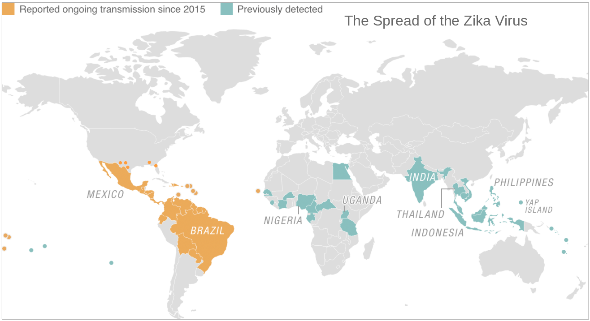
<p class="caption">Figure 2. The Pandemic Spread of the Zika Virus</p>
</div>

Most people infected with Zika won't have symptoms or even know they are infected with the virus (Figure 3). For those who do get sick, the illness is usually mild with symptoms lasting several days to a week. However, the virus can linger in the body for months. A person infected with Zika can pass it onto a sexual partner. 

<div class="figure">
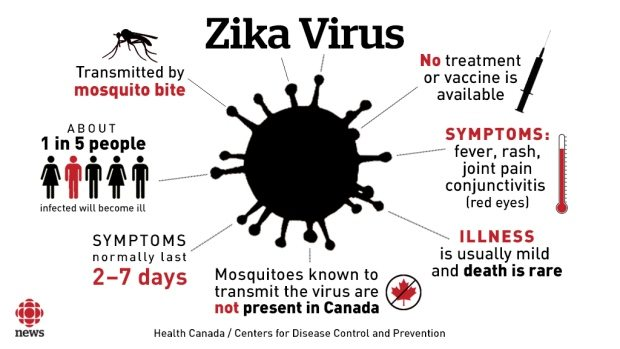
<p class="caption">Figure 3. Facts about the Zika Virus</p>
</div>

Pregnant women can also pass the virus to her fetus during pregnancy or around the time of birth (Figure 4). If that happens, Zika can cause severe brain defects for the infant including microcephaly, which is a sign of incomplete brain development.

Microcephaly results from an imbalance between cell production and cell death that leads to a reduced number of neuronal and glial cells within the brain, resulting in reduced brain growth. 

<div class="figure">
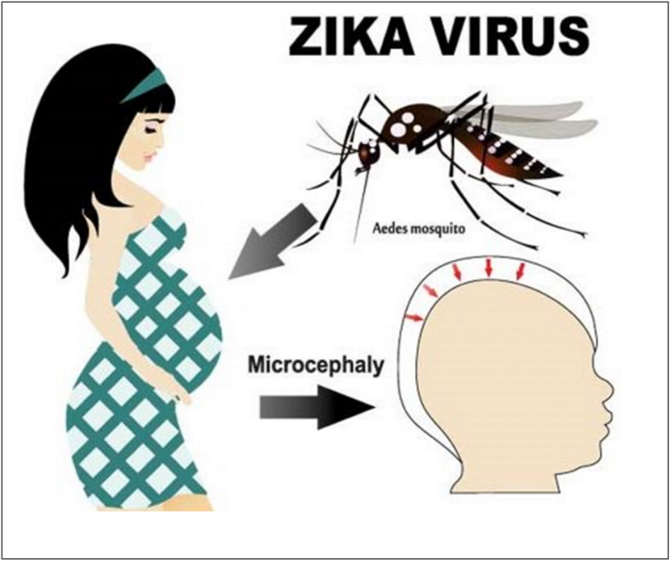
<p class="caption">Figure 4. Zika Pregnancy | Microcephaly</p>
</div>

Until recently the link between the Zika virus and microcephaly was still unknown. 

******
# Area of Active Research
******

From preliminary research, scientist have identified that human neural progenitor cells (hNPCs) are the direct target of the Zika virus (Figure 5). 

<div class="figure">
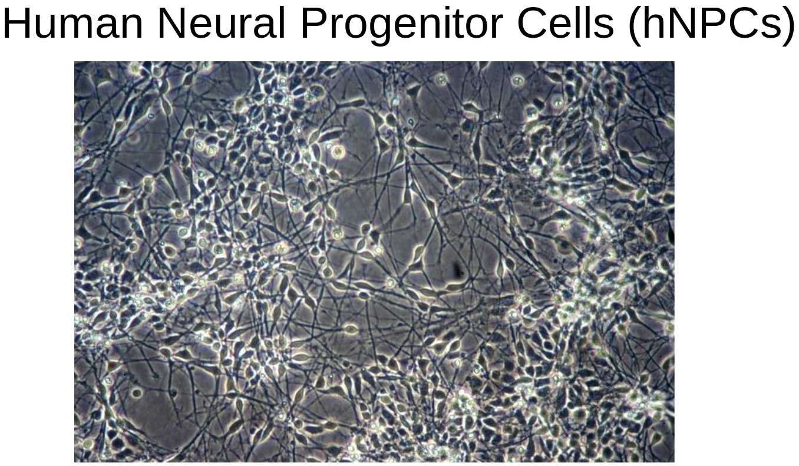
<p class="caption">Figure 5. Human neural progenitor cells (hNPCs)</p>
</div>

In an effort to determine the mechanism of Zika on human brain development, and hopefully provide a platform to screen for therapeutic compounds, the research group performed a global gene expression analysis between infants infected with the Zika Virus and healthy infants. 

The research group performed an RNA-seq analysis because they wanted to **(1)** identify which genes were diffentially expressed between these two groups of infants, and **(2)** they wanted to know what biological pathways are associated with the differentially expressed genes.

******
# Experimental Design{.tabset .tabset-fade}
******

In this section, I discuss key points of the experimental design.

## Library Preparation

Total RNA was extracted from human neural progenitor cells (hNPCs). An overview of the library preparation is shown in Figure 6 below.

Sequence Read Archive (SRA) files of the RNA-seq reads were downloaded from NCBI, and then converted to FASTQ format.

<div class="figure">
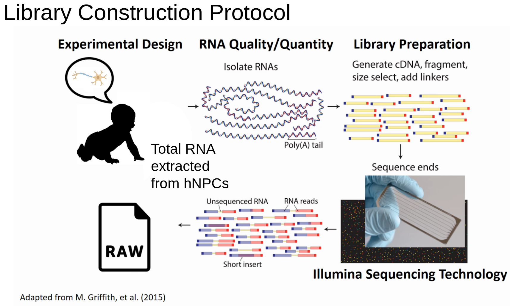
<p class="caption">Figure 6. Library Preparation of the RNA-seq Data</p>
</div>

## Expermental Design

The dataset consists of RNA-Seq libraries of Zika infected (treatment) and mock infected (control) human neural progenitor cells (hNPCs). 75 base pair paired-end reads were sequenced on the Illumina MiSeq platform. There are two biologicial replicates for both mock and Zika samples.

The read counts obtained for each sample is shown in Figure 7 below. 

<div class="figure">
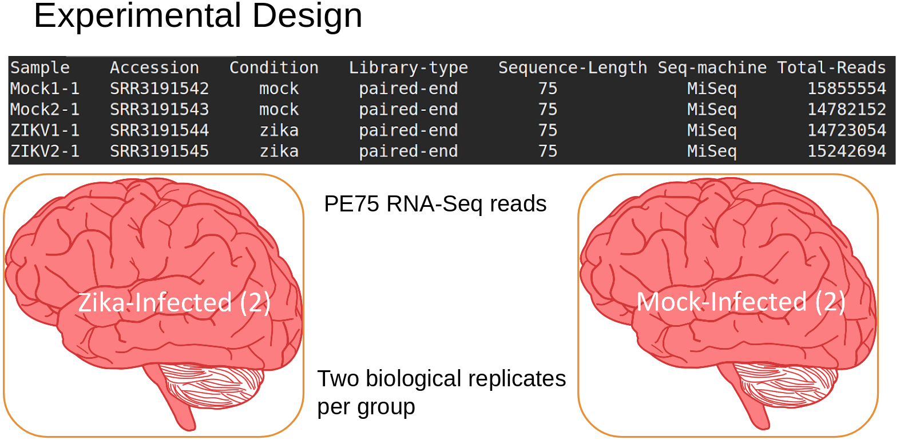
<p class="caption">Figure 7. Experimental Design</p>
</div>

## Initial Quality Control

After downloading the RNA-seq data, I generated a FASTQC report for each sample. Notice that how the read lengths vary -- this indicates that some sort of trimming was applied to the reads. 

We see this again in the Per Base Sequence Quality. The phred quality score is greater than or equal to 34 through to the end. The read quality is good. We can proceed with the analysis.

<div class="figure">
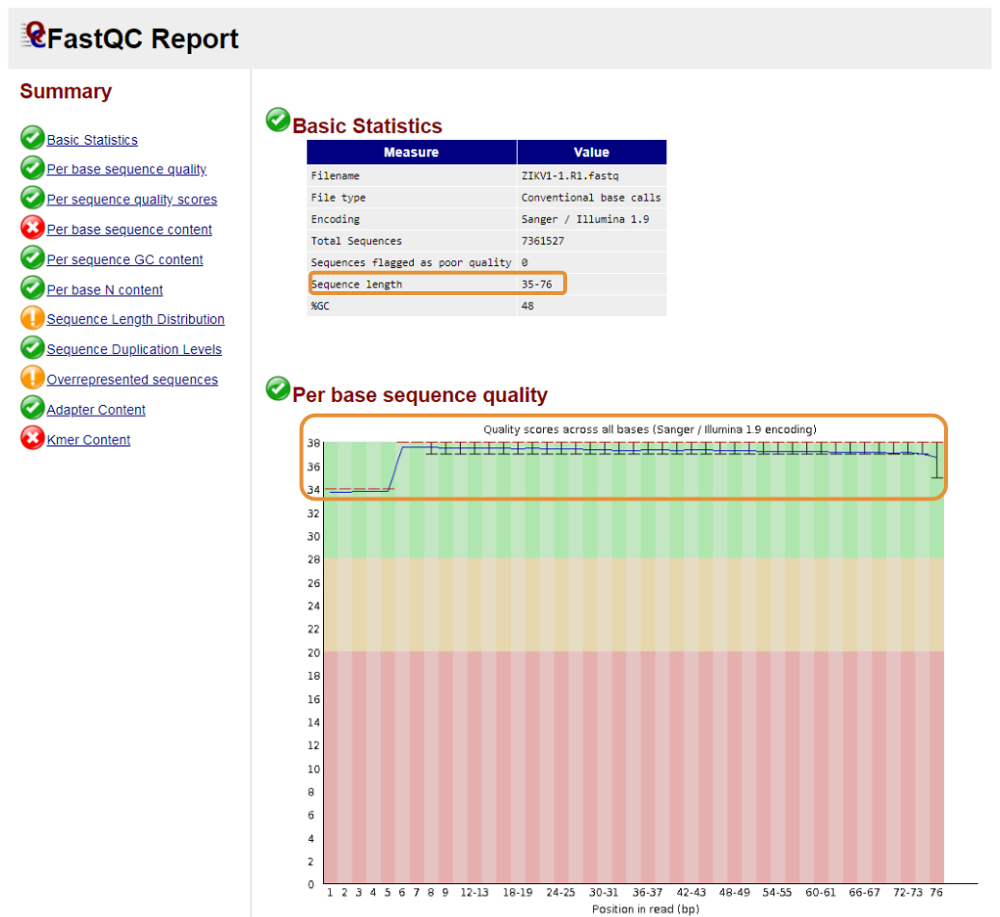
<p class="caption">Figure 8. Quality Control</p>
</div>

## Comparison of RNA-seq Pipelines

Here is an overview comparison of the RNA-seq Pipelines. The research group used the Tuxedo suite RNA-seq pipeline. I used a custom RNA-seq pipeline. The next section outlines the pipeline in more detail.

<div class="figure">
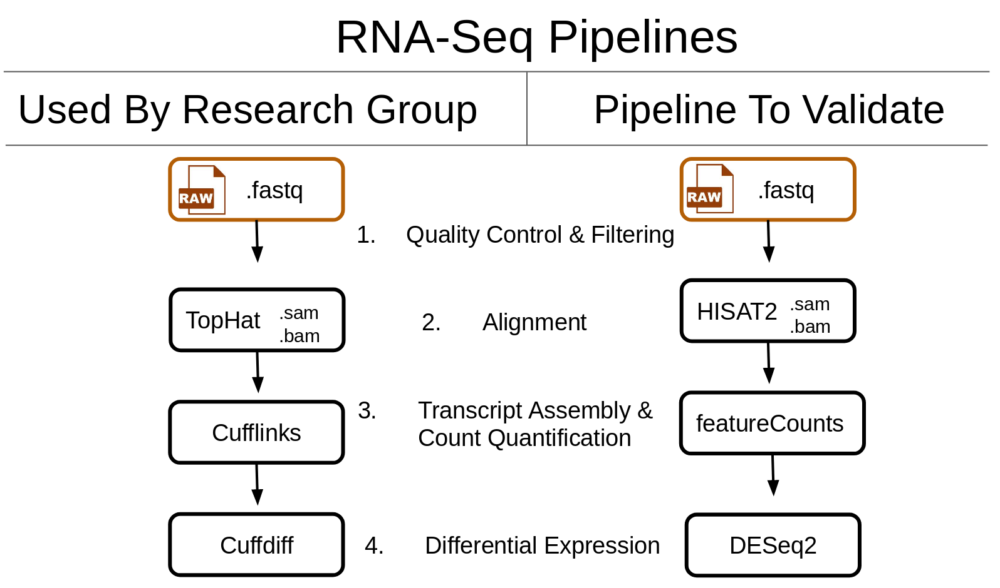
<p class="caption">Figure 9. Comparison of the RNA-Seq Pipelines</p>
</div>

******
# Custom RNA-Seq Pipeline: In-Depth
******

Here is a schema of the custom RNA-Seq pipeline. The RNA-Seq pipeline will answer the following 5 questions (outlined in **<span style="color:red">red</span>**) important to every differential expression analysis:

**<span style="color:red">(1)</span>** Which genes do the reads align to?
**<span style="color:red">(2)</span>** How many reads align to a specific gene?
**<span style="color:red">(3)</span>** Do different treatment groups express genes differentially?
**<span style="color:red">(4)</span>** Which genes are up-regulated? Which genes are down-regulated?
**<span style="color:red">(5)</span>** What biological pathways are these differentially expressed genes involved in?

<div class="figure">
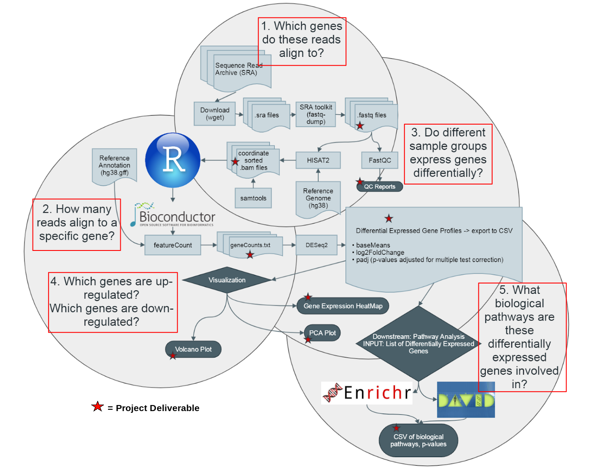
<p class="caption">Figure 10. Schema of Custom RNA-Seq Pipeline</p>
</div>

******
# Differential Expression Analysis in R: Bioconductor 
******

The first major step of the analysis is to perform sequence alignment.

For this, I used HISAT2, a splice-aware *dedicated* RNA-seq aligner, to map the sample reads to the human reference genome (hg38). Next, I used SAMtools to (1) convert the alignment file from SAM to BAM, and (2) sort the aligned reads by coordinate. 

The sorted BAM files were then imported into `R`. The following packages were loaded.


```r
# Load Packages
# visualization
library(ggplot2)
library(ggrepel)
library(RColorBrewer)

# wrangle
library(dplyr)

# differential expression analysis via Bioconductor 
library(Rsubread)
library(DESeq2)

bam_files <- list.files("ZikaRNASeq_files/data/bam", pattern = ".bam$", full.names=T)
samples <- c("Mock1-1", "Mock2-1", "ZIKV1-1", "VIKV2-1")
```

`featureCount` was used to perform transcript assembly and read count quantafication. This step of the analysis answers the questions: **<span style="color:red">(1)</span>** Which genes do the reads align to? **<span style="color:red">(2)</span>** How many reads map to a specific gene?

In the code below, I specify some of the following option parameters of `featureCount`:

* The reads are PE75. 
* The reference genome annotation file is `GRCh38.gtf`. 
* The annotation feature to quantify is the "number of reads per gene". 
* The gene symbols should be listed by the HGNC gene name. The genes symbols could also be listed by the Ensembl ID -- this is a canonical and unique code good for unequivocally identifying genes. 
* The operation will use 8 threads to perform the transcript assembly and read quantification. 

There are many other options parameters we can specify.


```r
# featureCounts
features <- featureCounts(files = bam_files,

              # annotation
              annot.ext = "ZikaRNASeq_files/data/refs/GRCh38.gtf",
              isGTFAnnotationFile = TRUE,
              GTF.featureType = "gene",
              GTF.attrType = "gene_name",

              # parameters specific to paired end reads
              isPairedEnd = TRUE,
              requireBothEndsMapped = TRUE,
              checkFragLength = FALSE,
              minFragLength = 50,
              maxFragLength = 600,

              # miscellaneous
              nthreads = 8,
              reportReads = TRUE
              )
```

```
## 
##         ==========     _____ _    _ ____  _____  ______          _____  
##         =====         / ____| |  | |  _ \|  __ \|  ____|   /\   |  __ \ 
##           =====      | (___ | |  | | |_) | |__) | |__     /  \  | |  | |
##             ====      \___ \| |  | |  _ <|  _  /|  __|   / /\ \ | |  | |
##               ====    ____) | |__| | |_) | | \ \| |____ / ____ \| |__| |
##         ==========   |_____/ \____/|____/|_|  \_\______/_/    \_\_____/
##        Rsubread 1.20.6
## 
## //========================== featureCounts setting ===========================\\
## ||                                                                            ||
## ||             Input files : 4 BAM files                                      ||
## ||                           P ZikaRNASeq_files/data/bam/Mock1-1.bam          ||
## ||                           P ZikaRNASeq_files/data/bam/Mock2-1.bam          ||
## ||                           P ZikaRNASeq_files/data/bam/ZIKV1-1.bam          ||
## ||                           P ZikaRNASeq_files/data/bam/ZIKV2-1.bam          ||
## ||                                                                            ||
## ||             Output file : ./.Rsubread_featureCounts_pid14670               ||
## ||                 Summary : ./.Rsubread_featureCounts_pid14670.summary       ||
## ||              Annotation : ZikaRNASeq_files/data/refs/GRCh38.gtf (GTF)      ||
## ||      Assignment details : <input_file>.featureCounts                       ||
## ||                                                                            ||
## ||                 Threads : 8                                                ||
## ||                   Level : meta-feature level                               ||
## ||              Paired-end : yes                                              ||
## ||         Strand specific : no                                               ||
## ||      Multimapping reads : not counted                                      ||
## || Multi-overlapping reads : not counted                                      ||
## ||                                                                            ||
## ||          Chimeric reads : counted                                          ||
## ||        Both ends mapped : required                                         ||
## ||                                                                            ||
## \\===================== http://subread.sourceforge.net/ ======================//
## 
## //================================= Running ==================================\\
## ||                                                                            ||
## || Load annotation file ZikaRNASeq_files/data/refs/GRCh38.gtf ...             ||
## ||    Features : 58051                                                        ||
## ||    Meta-features : 56305                                                   ||
## ||    Chromosomes/contigs : 47                                                ||
## ||                                                                            ||
## || Process BAM file ZikaRNASeq_files/data/bam/Mock1-1.bam...                  ||
## ||    Paired-end reads are included.                                          ||
## ||    Assign fragments (read pairs) to features...                            ||
## ||                                                                            ||
## ||    WARNING: reads from the same pair were found not adjacent to each       ||
## ||             other in the input (due to read sorting by location or         ||
## ||             reporting of multi-mapping read pairs).                        ||
## ||                                                                            ||
## ||    Read re-ordering is performed.                                          ||
## ||                                                                            ||
## ||    Total fragments : 16715456                                              ||
## ||    Successfully assigned fragments : 11875173 (71.0%)                      ||
## ||    Running time : 0.54 minutes                                             ||
## ||                                                                            ||
## || Process BAM file ZikaRNASeq_files/data/bam/Mock2-1.bam...                  ||
## ||    Paired-end reads are included.                                          ||
## ||    Assign fragments (read pairs) to features...                            ||
## ||                                                                            ||
## ||    WARNING: reads from the same pair were found not adjacent to each       ||
## ||             other in the input (due to read sorting by location or         ||
## ||             reporting of multi-mapping read pairs).                        ||
## ||                                                                            ||
## ||    Read re-ordering is performed.                                          ||
## ||                                                                            ||
## ||    Total fragments : 15630231                                              ||
## ||    Successfully assigned fragments : 10821632 (69.2%)                      ||
## ||    Running time : 0.48 minutes                                             ||
## ||                                                                            ||
## || Process BAM file ZikaRNASeq_files/data/bam/ZIKV1-1.bam...                  ||
## ||    Paired-end reads are included.                                          ||
## ||    Assign fragments (read pairs) to features...                            ||
## ||                                                                            ||
## ||    WARNING: reads from the same pair were found not adjacent to each       ||
## ||             other in the input (due to read sorting by location or         ||
## ||             reporting of multi-mapping read pairs).                        ||
## ||                                                                            ||
## ||    Read re-ordering is performed.                                          ||
## ||                                                                            ||
## ||    Total fragments : 15614870                                              ||
## ||    Successfully assigned fragments : 11072711 (70.9%)                      ||
## ||    Running time : 0.60 minutes                                             ||
## ||                                                                            ||
## || Process BAM file ZikaRNASeq_files/data/bam/ZIKV2-1.bam...                  ||
## ||    Paired-end reads are included.                                          ||
## ||    Assign fragments (read pairs) to features...                            ||
## ||                                                                            ||
## ||    WARNING: reads from the same pair were found not adjacent to each       ||
## ||             other in the input (due to read sorting by location or         ||
## ||             reporting of multi-mapping read pairs).                        ||
## ||                                                                            ||
## ||    Read re-ordering is performed.                                          ||
## ||                                                                            ||
## ||    Total fragments : 16144839                                              ||
## ||    Successfully assigned fragments : 11436394 (70.8%)                      ||
## ||    Running time : 0.66 minutes                                             ||
## ||                                                                            ||
## ||                         Read assignment finished.                          ||
## ||                                                                            ||
## \\===================== http://subread.sourceforge.net/ ======================//
```

As seen above, the transcript assembly and read quantification steps completed successfully.


```r
# count matrix
cts <- features$counts
colnames(cts) <- samples
```

Here is a screenshot of the `featureCount` results.

<div class="figure">
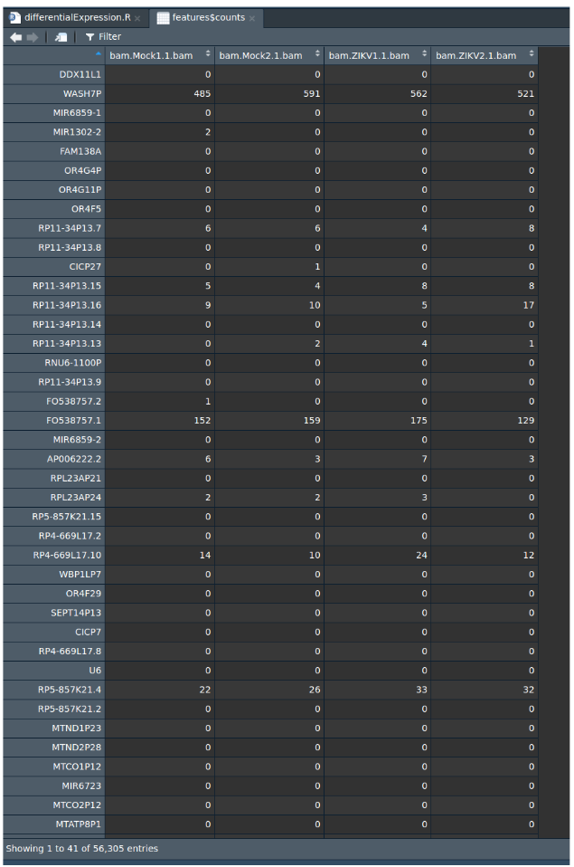
<p class="caption">Figure 11. FeatureCount results</p>
</div>

Next we perform differential expression analysis using `DESeq2`. This part of the analysis answers the questions: **<span style="color:red">(3)</span>** Do different treatment groups express genes differentially? **<span style="color:red">(4)</span>** Which genes are up-regulated? Which genes are down-regulated?

To use `DESeq2`, we must first set up the experimental design. Recall that there are two treatment groups: (1) `Mock` and (2) `Zika`, and two biological replicates per treatment group. The reads are `paired-end`.


```r
# set up experimental design
coldata <- matrix(c(rep("Mock",2), rep("Zika", 2), rep("paired-end", 4)), ncol = 2,
                  dimnames = list(samples,c("condition", "type"))) %>% as.data.frame()

coldata
```

```
##         condition       type
## Mock1-1      Mock paired-end
## Mock2-1      Mock paired-end
## ZIKV1-1      Zika paired-end
## VIKV2-1      Zika paired-end
```

From there, we can construct a `DESeq2` object.

The reference treatment group (or the null) in the hypothesis test is the `Mock` infected treatment.


```r
dds <- DESeqDataSetFromMatrix(countData = cts, colData = coldata, design = ~ condition)

# pre-filter for genes that span 10 or more genes
keep <- rowSums(counts(dds)) >= 10;
dds<- dds[keep,]

# Set the reference to be compared
dds$condition = relevel(dds$condition,"Mock")
```

Run `DESeq2` and format the results.

We can plot a few visualizations. The first is an MA plot. The red dots are differentially expressed genes. Genes above the $y=0$ log fold change are up-regulated, and genes below $y=0$ zero log fold change are down-regulated.


```r
# Run DESeq2 and format the results
dds <- DESeq(dds)
res <- results(dds)

## MA PLOT
plotMA(res, ylim=c(-2,2), main="MA Plot")
legend("topright",
       legend = c("Significant", "Not Significant"),
       col = c("red", "slategray"),
       pch = c(19,19), title = "Significance Level: p<0.1",
       cex = 1)
```

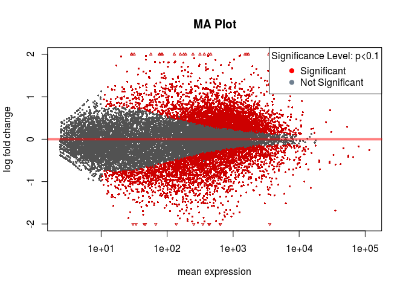<!-- -->

A volcano plot is another visualization of the differentially expressed genes. I increased the significance threshold to better visualize the top 10 up-regulated and top 10 down-regulated genes.

Note that we applied a multiple test correction to the p-values since we're performing multiple hypothesis tests. We used the False Discovery Rate (FDR) -- another multiple test correction is Bonferroni.


```r
# list the most statistically significant genes by the smallest p-value
resOrdered <- res[order(res$padj),]
cutoff = 5*10e-60

## Volcano Plot
resOrdered$Significant <- ifelse(resOrdered$padj < 0.05, "FDR < 0.05", "Not Sig")
l<-as.data.frame(resOrdered); l$Gene<-rownames(l)

q <- l[c(8,2,5,6,7)]; q <- q[complete.cases(q),]

q2 <- ggplot(q, aes(log2FoldChange, -log10(pvalue))) +
  geom_point(aes(col=Significant)) + ggtitle("Volcano Plot") +
  theme(plot.title = element_text(hjust = 0.5)) +
  geom_vline(xintercept = 1, color = "blue", linetype = 2) +
  geom_vline(xintercept = -1, color = "blue", linetype = 2) +
  geom_hline(yintercept=60, linetype=2, color = "blue") +
  scale_color_manual(values=c("red", "gray"))

q2+geom_text_repel(data=filter(q, padj<cutoff), aes(label=Gene))
```

```r
# heatmap
n = 10
topResults <- rbind( resOrdered[ resOrdered[,'log2FoldChange'] > 0, ][1:n,],
                     resOrdered[ resOrdered[,'log2FoldChange'] < 0, ][n:1,] )
```

Here is a list of the top statistically significant differentially expressed genes. 

```r
topResults[c(1:5,(2*n-4):(2*n)), c('baseMean','log2FoldChange','padj')]
```

```
## DataFrame with 10 rows and 3 columns
##           baseMean log2FoldChange          padj
##          <numeric>      <numeric>     <numeric>
## SLC7A5    3708.774       2.455606 4.745947e-258
## ASNS      3476.808       2.351461 2.866757e-252
## XBP1      1515.130       2.430653 1.980516e-140
## HERPUD1   1613.397       2.260734 2.208066e-118
## SLC3A2    3383.571       1.609150 7.783303e-114
## ARGLU1    4227.820      -1.321003  2.823906e-88
## LHX5-AS1  5994.452      -1.288913 5.292218e-108
## SFRP2     6273.764      -1.517010 1.020829e-116
## TPBG      3589.074      -2.134789 1.517381e-189
## WSB1     35291.400      -1.678251 2.693928e-216
```

```r
hmcol <- brewer.pal(11,'RdBu')
nCounts <- counts(dds, normalized=TRUE)
heatmap(as.matrix(nCounts[ row.names(topResults), ]), Rowv = NA, col = hmcol, mar = c(10,2),
        main = "Top 10 Up-Regulated and Top 10 Down-Regulated Genes")

legend("topright",
       legend = c("Up-regulated", "Down-regulated"),
       col = c(hmcol[11], hmcol[1]),
       pch = c(15,15),
       cex = 1.2)
```

<div class="figure">
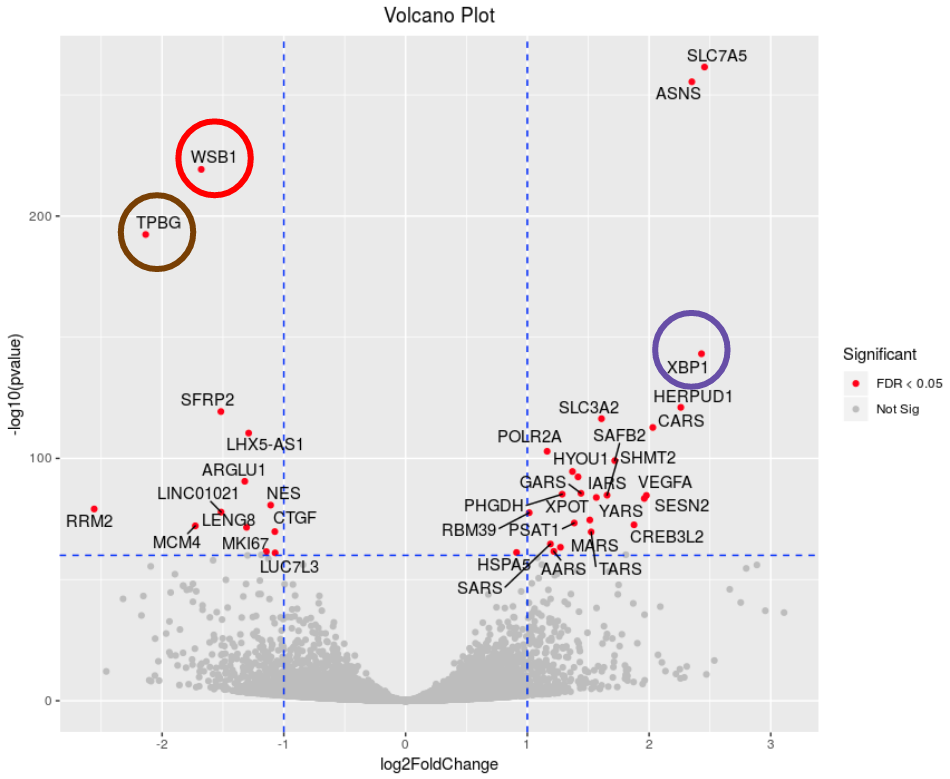
<p class="caption">Figure 12a. Volcano Plot</p>
</div>

<div class="figure">
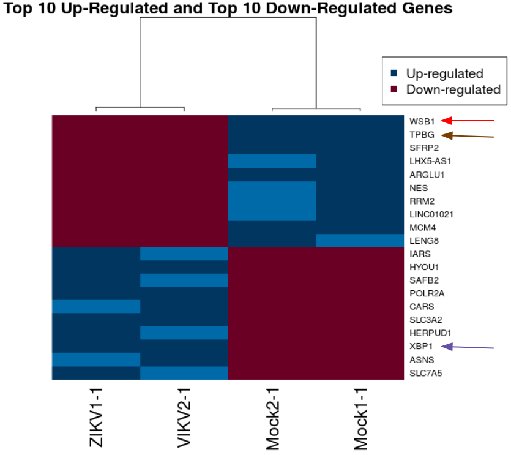
<p class="caption">Figure 12b. Heatmap Dendogram</p>
</div>

As shown in the figures above, `WSB1` and `TPBG` are examples of genes that are down-regulated with respect to the Zika infected treatment group. `XBP1` is an example of a gene that is up-regulated with respect to the Zika infected treatment group.

The dendogram heatmap shows how the samples cluster in the differential expression analysis. As expected, the biological replicates in each treatment group cluster together.

In RNA-seq experiments with multiple treatment groups and multiple biological replicates per treatment group, the dendogram heatmap can provide valuable insight on how the samples cluster.

Another visualization on how the samples cluster is in the Principal Component Analysis plot. As shown below, 97% of the model's variance is explained by the treatment group. As expected, the Zika biological replicates cluster together and the mock biological replicates cluster together.


```r
## PCA
vsdB <- varianceStabilizingTransformation(dds)
plotPCA(vsdB, intgroup = "condition") + ggtitle("PCA Plot") + theme(plot.title = element_text(hjust = 0.5))
```

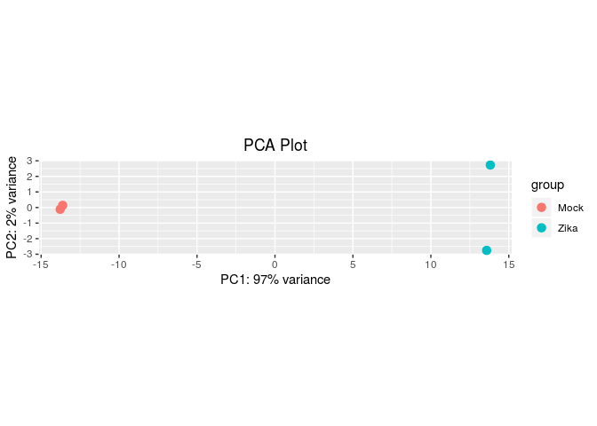<!-- -->

As a final step of the analysis, we can write to file the list of differentially expressed genes in order of significance.


```r
write.csv(as.data.frame(resOrdered), file="deseq2_output.csv")
```

<div class="figure">
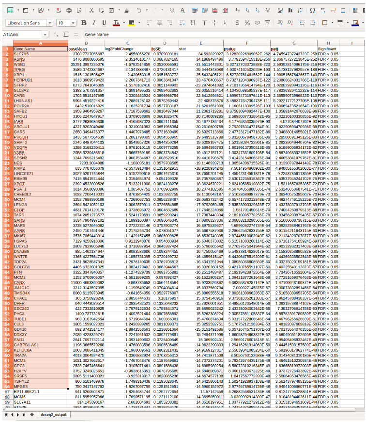
<p class="caption">Figure 13. DESeq2 results: List of Differentially Expressed Genes</p>
</div>

******
# Downstream Analysis of RNA-Seq{.tabset .tabset-fade}
******

Once we obtain our list of differentially expressed genes, we can perform a pathway analysis using a Gene Ontology database such as `DAVID` or `Enrichr`. This part of the analysis answers the question: **<span style="color:red">(5)</span>** What biological pathways are these differentially expressed genes involved in?

## DAVID 1

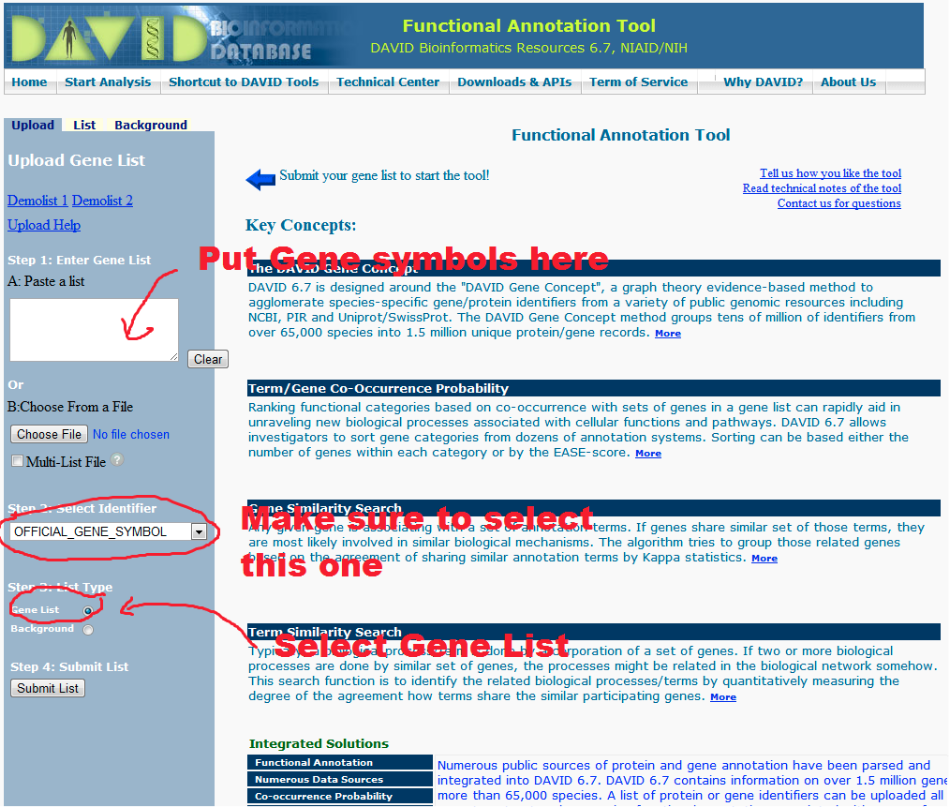

## DAVID 2

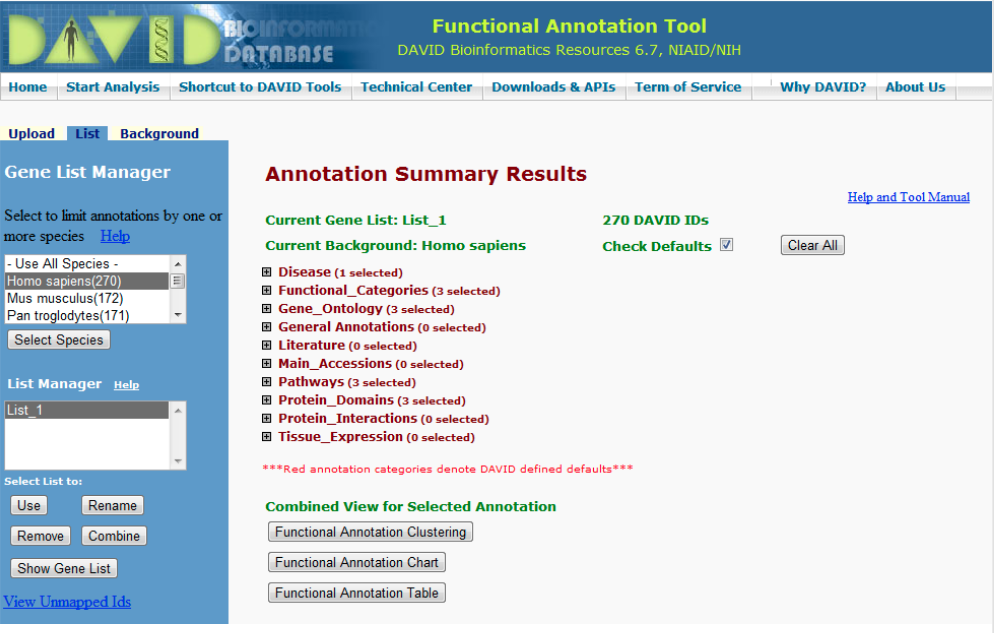

## DAVID 3

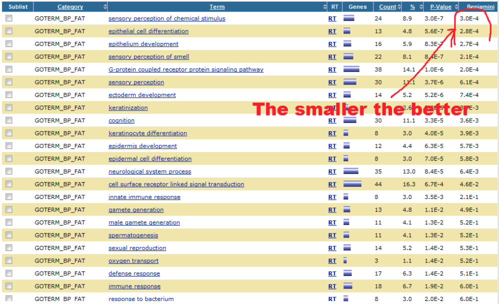

******
# Pathway Analysis Results
******

* There were many interesting biological pathways.

* One in particular were a set of downregulated genes after ZIKV infection that were found to enrich for targets of the transcription factors `E2F4` and `FOXM1`.

* Both transcription factors are known to regulate cell proliferation and play central role in many cancers.

******
# Conclusion: Validation Results
******

In closing, the custom RNA-seq pipeline performed really well. The results obtained from the custom RNA-seq pipeline are consistent with the results published in the original study. 

The custom RNA-seq pipeline reports the same top 25 up-regulated differentially expressed genes, and the same 25 down-regulated differentially expressed genes as the Tuxedo RNA-seq pipeline used in the publication. $\blacksquare$

== **Future Study** ==

We can increase the complexity of the RNA-seq experimental design by adding more treatment groups and/or conditions. Each treatment group or condition should have three biological replicates. It would be intersting to see how the samples cluster and what additional conclusions we can make in such a scenario.

Gene networks are a great visualization and offer an entry point in understanding what biological pathways are involved and how they are connected. Cytoscape, Gephi, and D3.js are all excellent tools for visualizing the molecular interaction networks and gene expression profiles. 

These are all great avenues to explore for future study.
